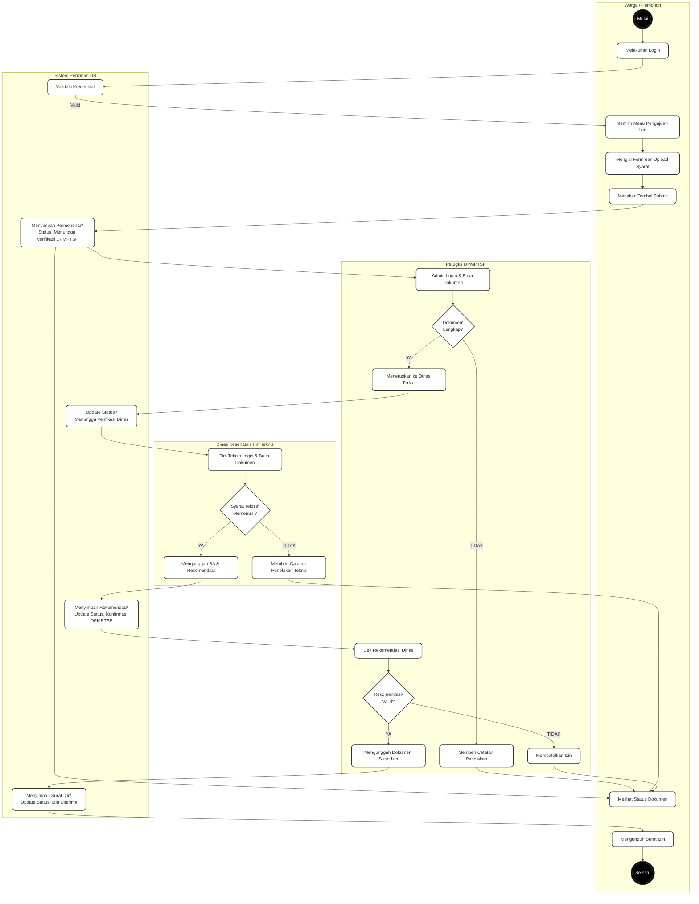

# Activity Diagram (Standar Skripsi)

## 1. Activity Diagram Pengajuan dan Verifikasi Izin

---
*Diagram ini menggunakan Swimlane flowchart untuk memperlihatkan pembagian tugas antar aktor sesuai standar pemodelan UML formal.*
