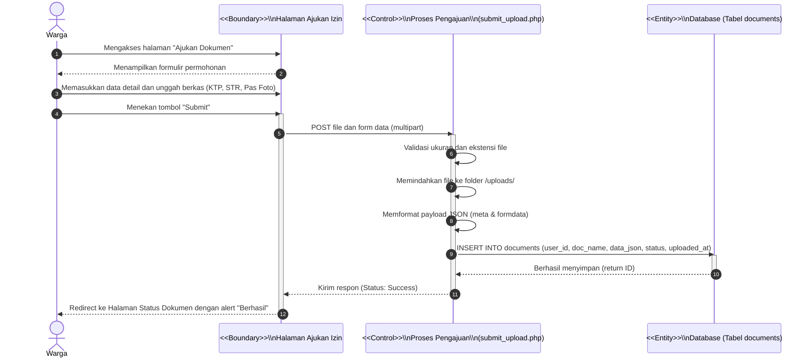
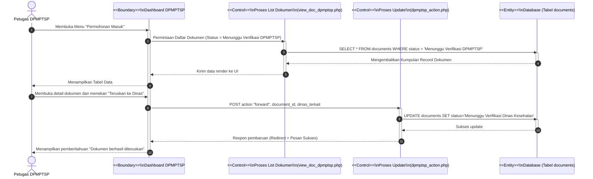
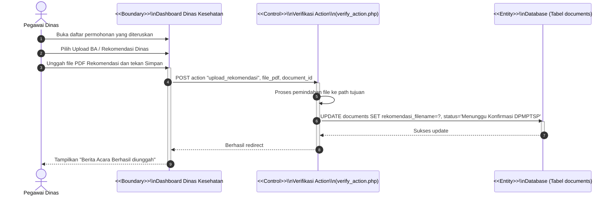

# Sequence Diagram (Standar Skripsi)

## 1. Sequence Diagram: Pengajuan Izin Baru oleh Warga

## 2. Sequence Diagram: Verifikasi Awal oleh DPMPTSP

## 3. Sequence Diagram: Proses Tim Teknis (Dinas) Mengunggah Rekomendasi

