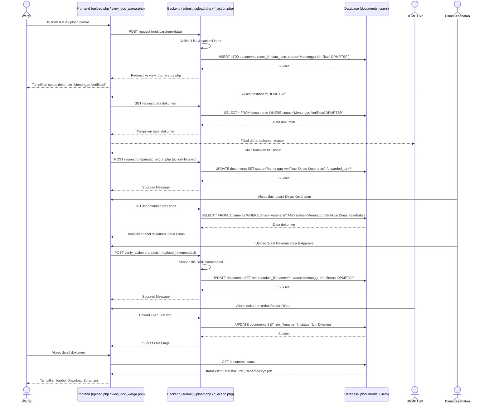

# Sequence Diagram

```mermaid
sequenceDiagram
    actor Warga
    participant FE as Frontend (upload.php / view_doc_warga.php)
    participant BE as Backend (submit_upload.php / *_action.php)
    participant DB as Database (documents, users)
    actor DPMPTSP
    actor DinasKesehatan

    %% Proses Warga Upload Dokumen
    Warga->>FE: Isi form izin & upload berkas
    FE->>BE: POST request (multipart/form-data)
    BE->>BE: Validasi file & sanitasi input
    BE->>DB: INSERT INTO documents (user_id, data_json, status='Menunggu Verifikasi DPMPTSP')
    DB-->>BE: Sukses
    BE-->>FE: Redirect ke view_doc_warga.php
    FE-->>Warga: Tampilkan status dokumen "Menunggu Verifikasi"

    %% Verifikasi DPMPTSP
    DPMPTSP->>FE: Akses dashboard DPMPTSP
    FE->>BE: GET request data dokumen
    BE->>DB: SELECT * FROM documents WHERE status='Menunggu Verifikasi DPMPTSP'
    DB-->>BE: Data dokumen
    BE-->>FE: Tampilkan tabel dokumen
    FE-->>DPMPTSP: Tabel daftar dokumen masuk
    
    DPMPTSP->>FE: Klik "Teruskan ke Dinas"
    FE->>BE: POST request to dpmptsp_action.php (action=forward)
    BE->>DB: UPDATE documents SET status='Menunggu Verifikasi Dinas Kesehatan', forwarded_by=?
    DB-->>BE: Sukses
    BE-->>FE: Success Message
    
    %% Verifikasi Dinas Kesehatan
    DinasKesehatan->>FE: Akses dashboard Dinas Kesehatan
    FE->>BE: GET list dokumen for Dinas
    BE->>DB: SELECT * FROM documents WHERE dinas='kesehatan' AND status='Menunggu Verifikasi Dinas Kesehatan'
    DB-->>BE: Data dokumen
    BE-->>FE: Tampilkan tabel dokumen untuk Dinas
    
    DinasKesehatan->>FE: Upload Surat Rekomendasi & Approve
    FE->>BE: POST verify_action.php (action=upload_rekomendasi)
    BE->>BE: Simpan file BA/Rekomendasi
    BE->>DB: UPDATE documents SET rekomendasi_filename=?, status='Menunggu Konfirmasi DPMPTSP'
    DB-->>BE: Sukses
    BE-->>FE: Success Message
    
    %% Finalisasi DPMPTSP
    DPMPTSP->>FE: Akses dokumen terkonfirmasi Dinas
    FE->>BE: Upload File Surat Izin
    BE->>DB: UPDATE documents SET izin_filename=?, status='Izin Diterima'
    DB-->>BE: Sukses
    BE-->>FE: Success Message
    
    %% Warga Download Izin
    Warga->>FE: Akses detail dokumen
    FE->>DB: GET document status
    DB-->>FE: status='Izin Diterima', izin_filename='xyz.pdf'
    FE-->>Warga: Tampilkan tombol Download Surat Izin
```
