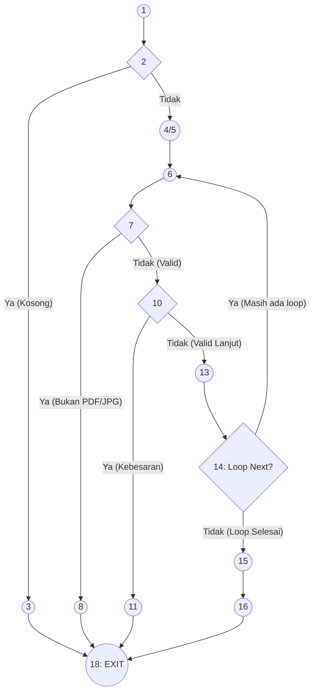

# Pengujian White Box (White Box Testing)

Pengujian White Box memeriksa logika internal dan alur eksekusi struktur kode program. Kami menggunakan metrik **Basis Path Testing** (termasuk *Flow Graph* dan *Cyclomatic Complexity*) untuk mengetahui seberapa banyak skenario pengujian unit _(unit testing)_ independen minimal yang perlu dilakukan.

## 1. Identifikasi Logika Utama (Contoh: Fungsi Validasi Kelengkapan Ekstensi & Upload)
Pada sistem ini, kita memilih fragmen logika inti pemrosesan form `submit_upload.php` yang memverifikasi _file extension_ dan mencegah unggahan ilegal.

**Pseudocode Representasi Logika:**
```text
1.   RECEIVE file_upload[]
2.   IF (file_upload is EMPTY) THEN
3.       RETURN Error("Tidak ada file yang diunggah")
4.   ELSE
5.       FOR EACH file IN file_upload:
6.           ext = GET_EXTENSION(file)
7.           IF (ext NOT IN ['jpg', 'png', 'pdf']) THEN
8.               RETURN Error("Ekstensi file dilarang")
9.           END IF
10.          IF (file_size > 5MB) THEN
11.              RETURN Error("Ukuran file terlalu besar")
12.          END IF
13.          MOVE_FILE(file, "/uploads/")
14.      END FOR
15.      DATABASE_INSERT(form_data, files_path)
16.      RETURN Success("Upload Berhasil")
17.  END IF
18.  EXIT
```

## 2. Pembuatan Flow Graph
Dari *pseudocode* di atas, bentuk **Control Flow Graph (CFG)** dapat digambarkan sebagai berikut:



*Keterangan Node:*
- **1, 2**: Pengecekan apakah array *file* kosong atau terisi.
- **3**: *Return error* array nol.
- **4, 5, 6, 14**: *Looping* pemeriksaan `for each`.
- **7, 8**: Pengecekan *extension* (Branch 1).
- **10, 11**: Pengecekan *size limit* (Branch 2).
- **13**: Eksekusi simpan *file* lokal.
- **15, 16**: Eksekusi DB Insert dan pemberian notifikasi Sukses.

## 3. Menghitung Cyclomatic Complexity (V(G))

Metode perhitungan kompleksitas silomatik menggunakan rumus graf keterhubungan logika.
Berdasarkan rumus graf: 
`V(G) = E - N + 2` 
*Dimana E = Jumlah Edge (anak panah), dan N = Jumlah Node (lingkaran).*

- **Jumlah Node (N):** 11 Nodes (*mengikuti pemodelan reduksi di chart*) -> (1, 2, 3, 4/6, 7, 8, 10, 11, 13, 14, 15/16, 18) = Sekitar **12 Node logika aktif**.
- **Jumlah Edge/Alur (E):** **15 Edge** panah aktif yang menghubungkan seluruh *diamond* dan *block* linear.

**Berdasarkan perhitungan Predicate Node (P):**
Rumus alternatif: `V(G) = P + 1` (P = Jumlah *decision node* / belah ketupat keputusan).
Terdapat **4 Node Predikat**:
1. Node 2 (Cek Array Kosong)
2. Node 7 (Cek Ekstensi Meleset)
3. Node 10 (Cek Batasan Ukuran)
4. Node 14 (Iterasi Loop Next - `ForEach`)

V(G) = 4 + 1 = **5**

**Kesimpulan Complexity:**
Sistem ini memiliki nilai Cyclomatic Complexity sebesar **5**. Karena nilai 5 berada di bawah 10 (`V(G) < 10`), hal ini mengindikasikan bahwa alur struktur algoritma fungsi unggahan (*submit_upload*) **tergolong sangat baik, sederhana, tidak terlalu kompleks**, dan mudah untuk di-*maintenance* maupun ditelusuri riwayat kesalahannya (*bug tracking*).

## 4. Jalur Basis Independen (Basis Path)
Berdasarkan V(G)=5, terdapat sekurang-kurangnya lima skenario jalur untuk menguji 100% *code coverage*:
1. **Path 1**: 1-2-3-18 (Berkas diunggah kosong).
2. **Path 2**: 1-2-4-6-7-8-18 (Berkas diunggah namun ekstensi tidak valid).
3. **Path 3**: 1-2-4-6-7-10-11-18 (Ekstensi aman, tetapi ukuran *file* lebih dari 5MB).
4. **Path 4**: 1-2-4-6-7-10-13-14-15-16-18 (Hanya ada 1 berkas aman, berhasil unggah dan DB masuk).
5. **Path 5**: 1-2-4-6-7-10-13-14-6-7-10-... (Skenario unggah lebih dari 1 syarat perizinan yang mana semua valid, hingga loop selesai baru *return success*).

---
**Kesimpulan Umum Pengujian White Box:**
Semua alur `path` yang didapat memetakan kemungkinan uji yang persis sama dengan implementasi pada skenario *Black Box*. Karena seluruh *Path* dapat direplikasi dan lulus eksekusi kondisional tanpa tersangkut ke titik celah di luar alur, pengujian algoritma unggah dokumen dianggap solid dan **valid (lulus uji)**.
